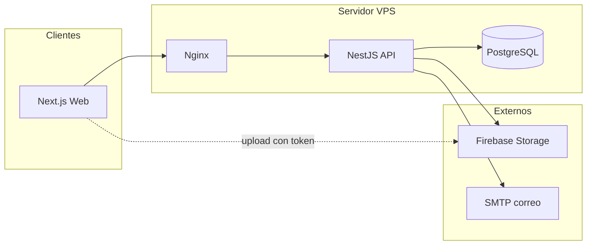
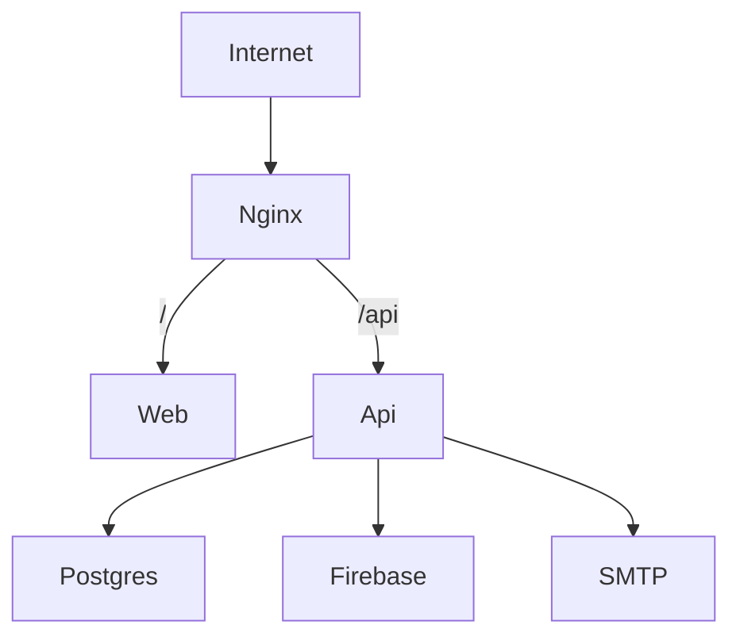

# Arquitectura — Sistema de control de actividades escolares

## Visión

Sistema tipo Google Classroom orientado a secundaria mexicana: el profesor publica actividades en un muro de clase; los alumnos entregan de forma individual o por equipo; hay exámenes con calificación; los padres consultan el progreso de sus hijos; el administrador gestiona la escuela, usuarios y ciclos escolares. El sistema envía notificaciones in-app y correos SMTP ante eventos clave.

## Decisiones de stack

| Capa | Tecnología |
|------|------------|
| Monorepo | pnpm workspaces + Turborepo |
| Frontend | Next.js (App Router) + React + TypeScript |
| Backend | NestJS (modular) + TypeScript |
| ORM / DB | Prisma + PostgreSQL |
| Auth | JWT + refresh token (correo/contraseña). Sin Google OAuth |
| Archivos | Firebase Storage (Admin SDK en API) |
| Correo | SMTP vía Nodemailer |
| Despliegue | VPS propio (Docker Compose: `web`, `api`, `postgres`, `nginx`) + proyecto Firebase (solo Storage) |

## Diagrama de contexto



## Roles y permisos (RBAC)

| Rol | Capacidades clave |
|-----|-------------------|
| `ADMIN` | CRUD escuela/ciclos/usuarios, asignar roles, ver todo |
| `TEACHER` | Crear/gestionar clases donde es miembro, publicaciones, tareas, exámenes, calificar, equipos |
| `STUDENT` | Unirse a clase (código), ver muro, entregar, presentar exámenes, ver notas propias |
| `PARENT` | Vincularse a hijos (código/aprobación), ver calificaciones y entregas del hijo |

- Un usuario tiene **un solo rol global** en v1.
- Dentro de una clase, `ClassMembership.roleInClass` distingue `teacher` | `student` (soporta varios profesores por clase).

### Guards (API)

- `JwtAuthGuard` — usuario autenticado
- `RolesGuard` — rol global (`ADMIN`, `TEACHER`, `STUDENT`, `PARENT`)
- `ClassMemberGuard` — membresía y rol dentro de la clase

## Módulos backend (`apps/api`)

| Módulo | Responsabilidad |
|--------|-----------------|
| `auth` | Registro, login, refresh, logout, me |
| `users` | Perfil, preferencias de notificación, listado admin |
| `schools` / `cycles` | Escuela y ciclos académicos |
| `classes` | CRUD clases, join por código, memberships multi-profesor |
| `posts` | Muro tipo Classroom |
| `assignments` | Tareas individuales/equipo + equipos |
| `submissions` | Entregas + vínculo a archivos |
| `exams` | Quizzes, preguntas, intentos, resultados |
| `grades` | Calificaciones unificadas (tarea/examen) |
| `parents` | Vínculos padre-hijo y vistas de progreso |
| `files` | Presign/confirm/download/delete + metadatos |
| `notifications` | In-app + disparo de correo |
| `mail` | Transporte Nodemailer/SMTP |
| `admin` | Operaciones globales de administración |

**Capas:** Controller → Service → PrismaService.

## Frontend (`apps/web`)

Arquitectura por **features** (no solo por rutas), alineada a las [10 heurísticas de Nielsen](./ux-heuristics.md):

```
apps/web/src/
  app/          # rutas App Router
  features/     # auth, classes, feed, assignments, exams, grades, parents, admin, notifications
  shared/       # ui, hooks, api-client, lib
  entities/     # tipos de dominio alineados a packages/shared
```

## Paquetes compartidos

- `packages/shared` — schemas Zod y tipos de contrato API
- `packages/tsconfig` / `packages/eslint-config` — toolchains

## Firebase Storage

- Auth de usuarios es **propia (JWT)**; Firebase solo almacena archivos.
- NestJS usa `firebase-admin` (`StorageService`).
- Flujo:
  1. `POST /files/presign` → path + token/URL de subida
  2. Cliente sube a Firebase
  3. `POST /files/confirm` → persiste `Attachment` en Postgres
  4. `GET /files/:id` → valida permisos → URL firmada temporal
- Env: `FIREBASE_PROJECT_ID`, `FIREBASE_CLIENT_EMAIL`, `FIREBASE_PRIVATE_KEY`, `FIREBASE_STORAGE_BUCKET`
- Service account **nunca** en frontend ni en el repo.

## Notificaciones SMTP

- Env: `SMTP_HOST`, `SMTP_PORT`, `SMTP_SECURE`, `SMTP_USER`, `SMTP_PASS`, `SMTP_FROM`
- `MailService` + `NotificationsService` (in-app + correo)
- Envío asíncrono en proceso en v1 (BullMQ/Redis opcional después)
- Eventos: nueva publicación/tarea/examen, recordatorio `dueAt`, confirmación de entrega, calificación, resultado de examen, vínculo padre-hijo

## Despliegue



- Docker Compose en el VPS: servicios `nginx`, `web`, `api`, `postgres`
- Secrets vía `.env` / secret manager del host
- Backups periódicos de PostgreSQL
- Proyecto Firebase separado (solo Storage + reglas restrictivas)

## Fases de implementación

| Fase | Contenido |
|------|-----------|
| 0 | Docs + scaffold monorepo + GitFlow |
| 1 | Auth + usuarios + escuela + roles |
| 2 | Clases + memberships + muro + Firebase Storage |
| 3 | Tareas individuales/equipo + entregas + calificaciones |
| 4 | Exámenes/quizzes + resultados |
| 5 | Notificaciones in-app + SMTP |
| 6 | Padres + panel admin + pulido UX |

## Documentación relacionada

- [Diagrama entidad-relación](./diagrama-er.md)
- [Diagrama de clases](./diagrama-clases.md)
- [Mapa de endpoints](./api-endpoints.md)
- [Estructura de archivos](./estructura-archivos.md)
- [Manual de desarrollo](./manual-desarrollo.md)
- [GitFlow](./gitflow.md)
- [Heurísticas UX](./ux-heuristics.md)
