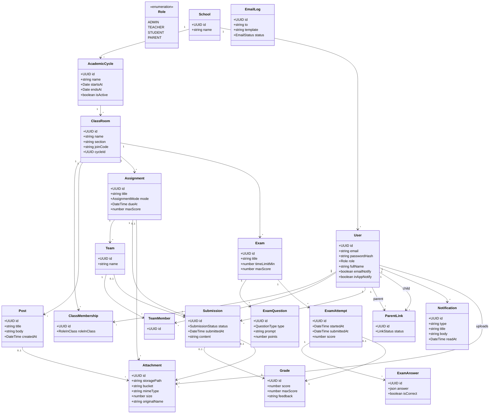
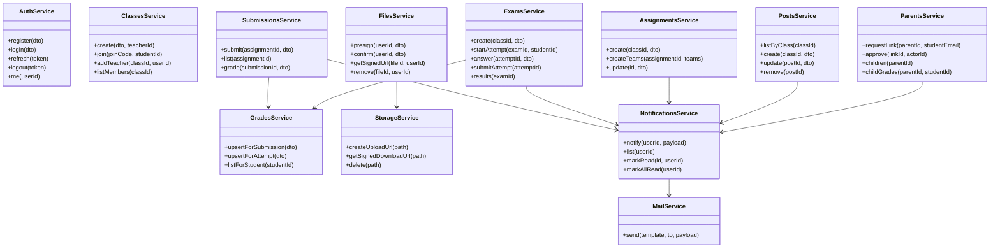
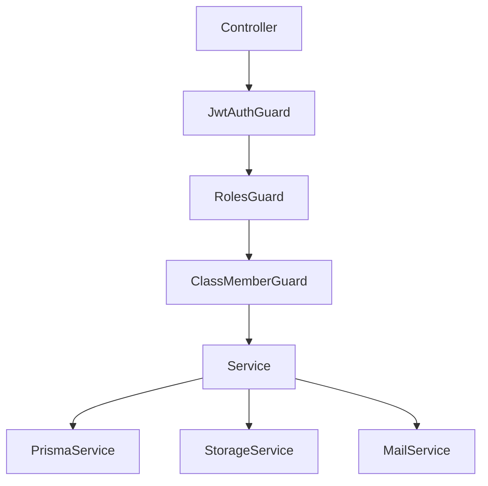

# Diagrama de clases

Modelo de dominio y servicios de aplicación. Los servicios viven en NestJS (`apps/api`); las entidades se materializan con Prisma.

## Dominio

## Servicios de aplicación (NestJS)

## Enumeraciones

| Enum | Valores |
|------|---------|
| `Role` | ADMIN, TEACHER, STUDENT, PARENT |
| `RoleInClass` | teacher, student |
| `AssignmentMode` | individual, team |
| `SubmissionStatus` | draft, submitted, graded, returned |
| `QuestionType` | multiple_choice, true_false, short |
| `LinkStatus` | pending, approved, rejected |
| `EmailStatus` | sent, failed |

## Capas y guards

