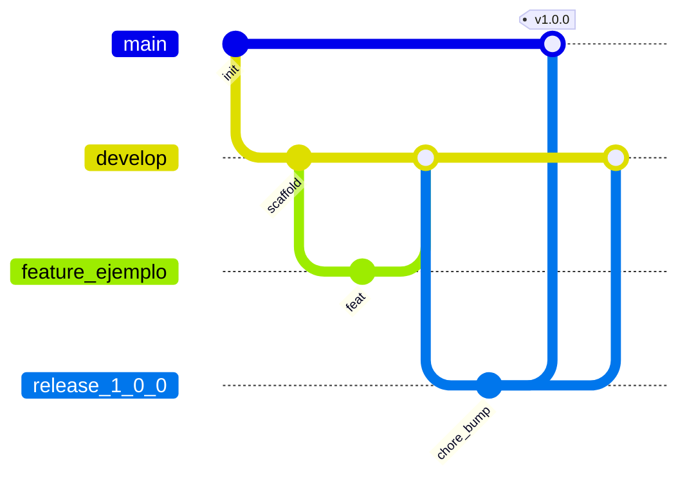

# GitFlow

Este repositorio usa **GitFlow**. No se hace commit directo a `main` ni a `develop` (salvo el bootstrap inicial).

## Diagrama



## Ramas

| Rama | Propósito |
|------|-----------|
| `main` | Producción. Solo merges desde `release/*` o `hotfix/*`. Tags `vX.Y.Z` |
| `develop` | Integración de features |
| `feature/<nombre>` | Trabajo de funcionalidad desde `develop` |
| `release/x.y.z` | Preparación de versión desde `develop` |
| `hotfix/x.y.z` | Parche urgente desde `main` |

Ejemplos: `feature/assignments-teams`, `feature/firebase-files`, `release/1.0.0`, `hotfix/1.0.1`.

## Reglas

1. **Nunca** push directo a `main` o `develop` en el día a día.
2. Toda feature abre **PR a `develop`** (review + CI verde).
3. Mensajes de commit convencionales:
   - `feat:` nueva funcionalidad
   - `fix:` corrección
   - `docs:` documentación
   - `chore:` tooling / deps
   - `refactor:` cambio sin comportamiento nuevo
   - `test:` pruebas
4. **Release:** crear `release/x.y.z` desde `develop` → PR a `main` → tag `vX.Y.Z` → merge de vuelta a `develop`.
5. **Hotfix:** rama desde `main` → PR a `main` + backport merge a `develop`.
6. En GitHub: branch protection en `main` y `develop` (require PR, status checks, sin force-push).

## Comandos frecuentes

```bash
# Nueva feature
git checkout develop
git pull origin develop
git checkout -b feature/mi-cambio

# Subir y abrir PR a develop
git push -u origin HEAD
gh pr create --base develop --title "feat: mi cambio" --body "..."

# Release
git checkout develop
git pull
git checkout -b release/1.0.0
# bump versión / changelog
git push -u origin HEAD
gh pr create --base main --title "release: 1.0.0"

# Tras merge a main
git checkout main && git pull
git tag -a v1.0.0 -m "v1.0.0"
git push origin v1.0.0
git checkout develop && git merge main && git push
```

## Qué va en cada tipo de PR

| Tipo | Base | Incluye |
|------|------|---------|
| feature | develop | Código + tests + docs si aplica |
| release | main | Versión, changelog, fixes menores |
| hotfix | main | Solo el parche + tests |
